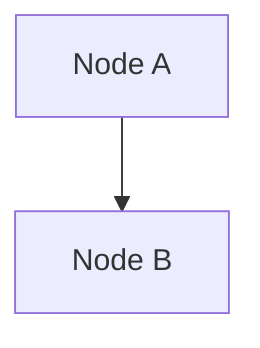

# Digestion Rules

Detailed rules for the Digest phase. Read this before performing digestion
on new raw files.

## Table of Contents

1. [Deduplication Logic](#deduplication-logic)
2. [Two-Step Digestion Process](#two-step-digestion-process)
3. [Page Merge Strategy](#page-merge-strategy)
4. [Image Processing](#image-processing)
5. [Naming Conventions](#naming-conventions)
6. [Template Fields](#template-fields)
7. [Index Update Rules](#index-update-rules)

---

## Deduplication Logic

Before digesting, determine which raw files actually need processing by running
the automated check script:

```bash
python <skill-path>/scripts/check_undigested.py --vault <vault-path>
```

The script uses a three-layer matching strategy:

### Layer 1: Exact match

Normalize filenames (strip special chars, lowercase) and compare raw file names
against all summary `source` fields. A direct match means the file is already
digested.

### Layer 2: Date + source cross-match

For multi-format content (e.g., preprocessed summaries + raw ASR transcripts
from the same episode):
1. Extract dates and source identifiers from filenames
2. Build a set of all `(date, source_id)` pairs from existing summaries
3. If a raw file's `(date, source_id)` pair is in this set, mark as `DUPE`

This handles cases like:
- `news_source_2026-04-27_AI繁荣...md` (preprocessed)
- `2026-04-27_news_source_raw.md` (raw transcript)
Both share date `2026-04-27` and source `news-source`, so if either has been
digested, both are marked as covered.

### Layer 3: Fuzzy prefix match

Compare the first 20 characters of normalized filenames. If they match, the file
is likely covered. Falls through to `MANUAL` category if no match is found at
any layer.

### Output categories

| Category | Meaning | Action |
|----------|---------|--------|
| `NEW` | Genuinely undigested content | Digest these files |
| `DUPE` | Already covered by another format | Skip |
| `SKIP` | Metadata/manifest/non-content files | Skip |
| `MANUAL` | Cannot auto-determine | Ask user |

### File exclusion rules

The script automatically skips files whose names contain: `manifest`, `metadata`,
`index`, `.git`, `__pycache__`. These are metadata files, not knowledge content.

---

## Source Field Priority

When a single piece of content exists in multiple formats (e.g., preprocessed
summary + raw ASR transcript), follow this priority for the summary's `source`
field:

1. **Preprocessed summary** (e.g., `news_source_2026-04-27_AI繁荣...md`) — preferred
   because it's more readable and structured
2. **Raw ASR transcript** (e.g., `2026-04-27_news_source_raw.md`) — use only
   when no preprocessed version exists

Rationale: clicking `source` in Obsidian should lead to the most readable version
of the original content, not a raw transcript full of homophone errors.

When an existing summary's `source` points to a raw transcript but a preprocessed
version also exists, the Audit phase can flag this as "source optimization suggested"
(but never auto-fix — Audit only reports).

### Source Path Verification

填写 `source` 字段时，必须通过 Glob 工具验证 raw 目录下的实际文件名，
不能凭记忆或猜测填写。步骤：
1. 从源文件路径提取文件名关键词
2. 用 Glob 搜索 `raw/**/{关键词}*` 确认实际路径
3. 使用 Glob 返回的精确文件名填入 source 字段

这确保中文弯引号、特殊破折号等字符与实际文件名完全一致。

---

## Two-Step Digestion Process

The digestion is split into two sequential steps: **Analysis → Generation**.
This separation ensures higher quality because reasoning about connections and
contradictions happens before any content is written.

### Step 1: Analysis

Before generating any wiki content, analyze the source document in the context
of the existing knowledge base.

**Inputs to gather:**
1. `purpose.md` (if exists in vault root) — defines knowledge base goals and scope.
   Read this BEFORE the raw file. It tells you what this knowledge base cares about,
   helping you prioritize which concepts and themes to emphasize.
2. The raw file content (with ASR corrections applied if applicable)
3. `knowledge/index.md` — current content catalog
4. Any existing concept cards or topic pages that seem related (found via index)

**Analysis output (internal, not written to files):**

1. **Key entities** — people, organizations, products, tools
   - Name, type (person/org/product/tool), role in source (central/peripheral)
   - Whether a matching entry already exists in the wiki (check index)

2. **Key concepts** — theories, methods, techniques, phenomena
   - Name and brief definition
   - Why it matters in this source
   - Whether a matching concept card already exists

3. **Main arguments & findings** — core claims, supporting evidence, evidence strength

4. **Connections to existing wiki** — the most valuable part of analysis
   - Which existing concepts does this source relate to?
   - Which existing topics does this source contribute to?
   - Does it strengthen, challenge, or extend existing knowledge?
   - Are there facts that bridge two previously unconnected concepts?

5. **Contradictions & tensions**
   - Does anything conflict with existing wiki content?
   - Are there internal tensions or caveats?
   - Rate confidence: definite contradiction vs. possible tension vs. nuance difference

6. **Recommendations**
   - What new wiki pages to create (concept cards, topic pages)
   - What existing pages to update (and what to add)
   - What to emphasize vs. de-emphasize
   - Any open questions worth flagging for the user

**Quality guidelines:**
- Be thorough but concise — focus on what's genuinely important
- When checking connections, read the relevant existing concept/topic pages,
  not just the index — the index only has names, not content
- If a folder context is available (e.g., file is in a subdirectory), use it
  as a categorization hint

### Step 2: Generation

Using the analysis as context, generate or update wiki files.

**The analysis is context, not a template to copy.** Do not echo the analysis
prose into the generated pages. The analysis informs WHAT to write and HOW it
connects to existing knowledge — the output is properly structured wiki content.

**Generation order:**
1. Summary page (the primary output for this source)
2. Concept cards (new or updated)
3. Topic pages (new or updated)
4. Index update
5. Report contradictions to user
6. Update overview.md — write or update `knowledge/overview.md` reflecting
   all content digested so far (including this session). If it doesn't exist,
   create it using `templates/tpl-overview.md`.

**Key principle:** Every generated page should reflect awareness of existing
knowledge. A concept card updated with a new source should integrate the new
information coherently with what's already there — not just append a new bullet.

---

## Page Merge Strategy

When a new source contributes information to an existing concept card or topic
page, apply a merge strategy instead of simple append.

### Concept card merge rules

When updating an existing concept card with new information from a source:

1. **Frontmatter:**
   - `updated`: set to today
   - Do NOT change `name`, `name_en`, `created`

2. **一句话定义:** Keep the existing definition unless the new source provides
   a clearer or more precise one. If changing, preserve the old definition as
   a secondary perspective.

3. **详细解释:** Integrate new insights into the existing explanation. Add new
   paragraphs for genuinely new angles. Do not duplicate points already covered.

4. **相关来源:** Add the new source summary link with a contribution note.
   Example: `[[摘要名-摘要-日期]] — 补充了 XXX 方面的视角`

5. **与其他概念的关系:** Add any new relationships discovered. Preserve all
   existing relationships.

### Topic page merge rules

When updating an existing topic page with new content from a source:

1. **Frontmatter:**
   - `updated`: set to today
   - `related_summaries`: add the new summary filename
   - Do NOT change `title`, `created`

2. **核心概念:** Add new concepts from this source. Update definitions only if
   the new source provides better ones.

3. **主题脉络:** This is the main merge target. Integrate the new source's
   perspectives into the existing narrative structure:
   - If the source introduces a new sub-topic, add a new subsection
   - If it adds to an existing sub-topic, integrate the new points
   - Do NOT just append a new block — weave it into the existing structure
   - Preserve all existing content

4. **实践要点:** Add new actionable insights. Do not remove existing ones.

### Merge safety rules

- **Never delete existing content** — only add or integrate
- **Never change locked fields** — `type`, `name`/`title`, `created`
- **If uncertain whether to merge or append** — append is safer than rewriting
- **When in doubt, show the user** the proposed merge and ask for confirmation

---

## Image Processing

### Step 1: Classify every image

For each image found in a raw file, assign one category:

| Type | Description | Action |
|------|-------------|--------|
| **A** | Architecture diagrams, flowcharts, hierarchies, state transitions | Convert to Mermaid |
| **B** | Data comparisons, parameter tables, progress metrics | Convert to markdown table |
| **C** | Operation guides, step-by-step screenshots | Keep original screenshot |
| **D** | Reference screenshots, product UI, demo effects | Keep reference + text description |
| **E** | Decorative (covers, QR codes, dividers, ads) | Ignore entirely |

### Step 2: Process by type

**Type A → Mermaid diagram**

Infer structure from surrounding context. Generate:

````markdown


> 基于原文推断，如有差异请查看原图：``
````

Choose Mermaid type based on content:
- `graph TD` or `graph LR` — architecture / hierarchy
- `flowchart` — processes with branching
- `sequenceDiagram` — interaction sequences
- `stateDiagram` — state transitions

**Type B → Markdown table**

Extract data points from context:

```markdown
| 指标 | 第一周 | 第二周 |
|------|--------|--------|
| 提交数 | 300+ | 500+ |

> 数据基于原文描述提取，详见原图：``
```

**Type C → Keep original screenshot**

```markdown


（操作指引：xxx 功能的配置/使用步骤截图，详见原图）
```

**Type D → Keep reference + description**

```markdown

（一句话描述图片核心内容）
```

**Type E → Ignore**

Do not include in the summary at all.

### Remote URL images

Images with `https://...` URLs cannot be read locally. Use text inference only.
Apply the same classification, but note that verification is not possible.

### Key Images section format

Place after "原文金句" section:

```markdown
## 关键图片

> 以下图表基于原文上下文推断生成，如需查看原图请跳转至原始文件。
```

Then list all non-E-type images in their processed form.

### Image reference format in summaries

All image references in summaries must use **Obsidian wikilink format** with
vault-relative paths, not Markdown relative paths:

- Correct: `![[raw/images/xxx.jpg]]`
- Correct (with alias): `![[raw/images/xxx.jpg|图片描述]]`
- Wrong: `` — relative paths break in Obsidian
- Wrong: `` — same problem

Wikilinks resolve from the vault root regardless of which subdirectory the
summary file is in, so `![[raw/images/xxx.jpg]]` always works.

**Do not wrap image wikilinks in backticks.** Backtick-wrapped content renders
as inline code in Obsidian, preventing the image from displaying. Always place
`![[raw/images/xxx.jpg]]` on its own line or inside a blockquote, never inside
backticks.

---

## Naming Conventions

### Summary filenames

Pattern: `{title}-摘要-{YYYY-MM-DD}.md`

- Title: first 40 characters of original article title
- Remove unsafe characters: `\ / : * ? " < > | # % ^ & $ ! \` ' = ~`
- Truncate safe portion to 80 chars max
- Example: `OpenClaw记忆系统全解析-摘要-2026-04-12.md`

### Concept card filenames

Pattern: `{concept-name}-概念.md`
- Use the concept's commonly known Chinese name
- Example: `上下文工程-概念.md`, `AI记忆系统-概念.md`

### Topic page filenames

Pattern: `{topic-name}-主题.md`
- Use the topic's commonly known Chinese name
- Example: `AI编程方法-主题.md`, `金融与经济-主题.md`

---

## Template Fields

### Summary (tpl-summary.md)

**Frontmatter:**

| Field | Required | Description |
|-------|----------|-------------|
| `source` | yes | Obsidian wikilink to raw file, e.g. `"[[raw/2026-04-12/filename.md]]"` |

The source field must use Obsidian wikilink format so it renders as a clickable link
in the properties panel. Do not use plain text paths — they won't be clickable.
| `title` | yes | Original article title |
| `date` | yes | `YYYY-MM-DD` format |
| `author` | yes | Original author (empty string if unknown) |
| `tags` | yes | List of relevant tags |

**Body sections (all required):**

> **板块标题是固定标识符，必须精确匹配下方列出的名称，不允许使用同义词替换。**
> 例如："一句话摘要"不能写成"一句话总结"，"原文金句"不能写成"精彩引述"。
> 短摘要无金句时，使用占位文本 `（无显著原文金句）`，而非删除板块。

1. **一句话摘要** — One sentence capturing the core thesis
2. **核心要点** — Bullet list of key points
3. **关键概念** — `**concept**: explanation` format, one per line
4. **原文金句** — Blockquotes of notable passages
5. **关键图片** — Processed images per classification rules above
6. **💡 我的补充** — Personal insights (can be placeholder)
7. **与其他内容的关联** — Links to related summaries/concepts/topics

### Concept card (tpl-concept.md)

**Frontmatter:**

| Field | Required | Description |
|-------|----------|-------------|
| `name` | yes | Concept name in Chinese |
| `name_en` | yes | English name (empty if N/A) |
| `created` | yes | Creation date |
| `updated` | yes | Last update date |

**Body sections:**

1. **一句话定义** — Precise, concise definition
2. **详细解释** — 2-3 paragraphs explaining core meaning, how it works, why it matters
3. **相关来源** — Links to source summaries with contribution notes
4. **与其他概念的关系** — Links to related concepts with relationship description
   **强制规则**：此板块内所有概念引用的 wikilink 必须使用完整 slug 格式 `[[xxx-概念]]`，
   禁止使用裸概念名（如 `[[Embedding 与 RAG]]` 应写为 `[[Embedding 与 RAG-概念]]`）。
5. **💡 我的理解** — Personal understanding, analogies, supplements

### Topic page (tpl-topic.md)

**Frontmatter:**

| Field | Required | Description |
|-------|----------|-------------|
| `title` | yes | Topic name |
| `created` | yes | Creation date |
| `updated` | yes | Last update date |
| `related_summaries` | yes | List of linked summary filenames |

**Body sections:**

1. **概述** — 2-3 sentence overview
2. **核心概念** — Table: `| 概念 | 定义 | 来源 |`
3. **主题脉络** — Sub-topics with integrated views from multiple summaries
4. **实践要点** — Actionable insights
5. **💡 我的实践经验** — Personal experience notes
6. **关联主题** — Links to related topic pages

---

## Index Update Rules

When updating `knowledge/index.md` after digestion:

### Statistics

Count actual files in each directory and update the header:

```
> 原始文件数：{N} | 摘要数：{N} | 主题页数：{N} | 概念卡数：{N}
```

Also update `> 最后更新：{YYYY-MM-DD}`.

### Concept index table

Each row format:

```
| 概念名 | [[概念名-概念]] | 一句话定义 |
```

The "文件" column **must** use Obsidian double-bracket wikilinks: `[[xxx-概念]]`.
Plain text and markdown links are both wrong.

### Topic navigation table

Each row format:

```
| 主题名 | [[主题名-主题]] | 涉及摘要数 | 简介 |
```

The "文件" column **must** use wikilinks: `[[xxx-主题]]`.

### Timeline index

Each row format:

```
| 日期 | [[摘要文件名]] | 标题 |
```

The "摘要文件" column **must** use wikilinks: `[[xxx-摘要-xxx]]`.

### Adding new entries

- New concept: append row to concept index table
- New topic: append row to the appropriate category in topic navigation
  (create a new category heading if needed)
- Updated topic: refresh the "涉及摘要数" in its row
- New summary: add row to the timeline index in the correct month section
