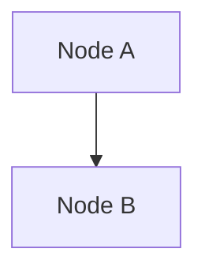

# Digestion — Generation Rules

> v1.12.0 切片（从 digestion-rules.md 拆出）。Digest Step 1 Analysis + Step 2 Generation 阶段读取。
> 其他切片：[dedup.md](dedup.md) / [review.md](review.md)

---

## Two-Step Digestion Process

The digestion is split into two sequential steps: **Analysis → Generation**.
This separation ensures higher quality because reasoning about connections and
contradictions happens before any content is written.

### Step 1: Analysis

Before generating any wiki content, analyze the source document in the context
of the existing knowledge base.

**Inputs to gather:**
1. `purpose.md` (if exists in vault root) — defines knowledge base goals and scope.
   Read this BEFORE the raw file. It tells you what this knowledge base cares about,
   helping you prioritize which concepts and themes to emphasize.
2. The raw file content (with ASR corrections applied if applicable)
3. `knowledge/index.md` — current content catalog
4. Any existing concept cards or topic pages that seem related (found via index)

**Analysis output (internal, not written to files):**

1. **Key entities** — people, organizations, products, tools
   - Name, type (person/org/product/tool), role in source (central/peripheral)
   - Whether a matching entry already exists in the wiki (check index)

2. **Key concepts** — theories, methods, techniques, phenomena
   - Name and brief definition
   - Why it matters in this source
   - Whether a matching concept card already exists

3. **Main arguments & findings** — core claims, supporting evidence, evidence strength

4. **Connections to existing wiki** — the most valuable part of analysis
   - Which existing concepts does this source relate to?
   - Which existing topics does this source contribute to?
   - Does it strengthen, challenge, or extend existing knowledge?
   - Are there facts that bridge two previously unconnected concepts?

5. **Contradictions & tensions**
   - Does anything conflict with existing wiki content?
   - Are there internal tensions or caveats?
   - Rate confidence: definite contradiction vs. possible tension vs. nuance difference

6. **Recommendations**
   - What new wiki pages to create (concept cards, topic pages)
   - What existing pages to update (and what to add)
   - What to emphasize vs. de-emphasize
   - Any open questions worth flagging for the user

**Quality guidelines:**
- Be thorough but concise — focus on what's genuinely important
- When checking connections, read the relevant existing concept/topic pages,
  not just the index — the index only has names, not content
- If a folder context is available (e.g., file is in a subdirectory), use it
  as a categorization hint

### Step 2: Generation

Using the analysis as context, generate or update wiki files.

**The analysis is context, not a template to copy.** Do not echo the analysis
prose into the generated pages. The analysis informs WHAT to write and HOW it
connects to existing knowledge — the output is properly structured wiki content.

**Generation order:**
1. Summary page (the primary output for this source)
2. Concept cards (new or updated)
3. Topic pages (new or updated)
4. Index update
5. Report contradictions to user
6. Update overview.md — write or update `knowledge/overview.md` reflecting
   all content digested so far (including this session). If it doesn't exist,
   create it using `templates/tpl-overview.md`.

**Key principle:** Every generated page should reflect awareness of existing
knowledge. A concept card updated with a new source should integrate the new
information coherently with what's already there — not just append a new bullet.

---

## Page Merge Strategy

When a new source contributes information to an existing concept card or topic
page, apply a merge strategy instead of simple append.

### Concept card merge rules

When updating an existing concept card with new information from a source:

1. **Frontmatter:**
   - `updated`: set to today
   - Do NOT change `name`, `name_en`, `created`

2. **一句话定义:** Keep the existing definition unless the new source provides
   a clearer or more precise one. If changing, preserve the old definition as
   a secondary perspective.

3. **详细解释:** Integrate new insights into the existing explanation. Add new
   paragraphs for genuinely new angles. Do not duplicate points already covered.

4. **相关来源:** Add the new source summary link with a contribution note.
   Example: `[[摘要名-摘要-日期]] — 补充了 XXX 方面的视角`

5. **与其他概念的关系:** Add any new relationships discovered. Preserve all
   existing relationships.

### Topic page merge rules

When updating an existing topic page with new content from a source:

1. **Frontmatter:**
   - `updated`: set to today
   - `related_summaries`: add the new summary filename
   - Do NOT change `title`, `created`

2. **核心概念:** Add new concepts from this source. Update definitions only if
   the new source provides better ones.

3. **主题脉络:** This is the main merge target. Integrate the new source's
   perspectives into the existing narrative structure:
   - If the source introduces a new sub-topic, add a new subsection
   - If it adds to an existing sub-topic, integrate the new points
   - Do NOT just append a new block — weave it into the existing structure
   - Preserve all existing content

4. **实践要点:** Add new actionable insights. Do not remove existing ones.

### Merge safety rules

- **Never delete existing content** — only add or integrate
- **Never change locked fields** — `type`, `name`/`title`, `created`
- **If uncertain whether to merge or append** — append is safer than rewriting
- **When in doubt, show the user** the proposed merge and ask for confirmation

---

## Image Processing

### Step 1: Classify every image

For each image found in a raw file, assign one category:

| Type | Description | Action |
|------|-------------|--------|
| **A** | Architecture diagrams, flowcharts, hierarchies, state transitions | Convert to Mermaid |
| **B** | Data comparisons, parameter tables, progress metrics | Convert to markdown table |
| **C** | Operation guides, step-by-step screenshots | Keep original screenshot |
| **D** | Reference screenshots, product UI, demo effects | Keep reference + text description |
| **E** | Decorative (covers, QR codes, dividers, ads) | Ignore entirely |

### Step 2: Process by type

**Type A → Mermaid diagram**

Infer structure from surrounding context. Generate:

````markdown


> 基于原文上下文推断生成（未启用识图校验）。如有差异请查看原图：``

> 注：v1.11.0 起，当 Step 3 识图校验已对该图执行时，去除"（未启用识图校验）"限定词；未执行（识图关闭 / 模型不支持视觉 / 策略=不识图）时保留此限定词。
````

Choose Mermaid type based on content:
- `graph TD` or `graph LR` — architecture / hierarchy
- `flowchart` — processes with branching
- `sequenceDiagram` — interaction sequences
- `stateDiagram` — state transitions

**Type B → Markdown table**

Extract data points from context:

```markdown
| 指标 | 第一周 | 第二周 |
|------|--------|--------|
| 提交数 | 300+ | 500+ |

> 数据基于原文描述提取（未启用识图校验）。详见原图：``
```

**Type C → Keep original screenshot**

```markdown


（操作指引：xxx 功能的配置/使用步骤截图，详见原图）
```

**Type D → Keep reference + description**

```markdown

（一句话描述图片核心内容）
```

**Type E → Ignore**

Do not include in the summary at all.

### Step 3: Conditional image recognition (v1.11.0)

When the triggers below all hold, upgrade A/B/D processing from text inference
to **real image recognition**. Otherwise skip this step entirely and use
Step 1-2 text inference + disclaimer (v1.10.0 behavior). **Output is never
blocked by recognition failure — degrade gracefully.**

**Triggers (ALL must hold):**
1. `purpose.md` sets `image_recognition: enabled`
2. The recognition strategy chosen at pre-check step 4 ≠ "不识图"
3. The executing model supports image recognition (multimodal). If you are
   unsure or the model lacks vision, degrade — do not attempt recognition.

**Execution by user strategy:**
- "仅 A 类": recognize Type A only
- "全部识图": recognize Type A / B / D (Type C keeps the original per Step 2 —
  recognition adds little; Type E is ignored)

**Type A recognition:**
1. First generate the Mermaid draft per Step 2 rules (from surrounding text)
2. Read the local image, **verify/correct** the draft against the real image
   (node names, edge directions, hierarchy)
3. Output the corrected Mermaid; **drop the "（未启用识图校验）" disclaimer**

**Type B recognition:**
1. First generate the markdown table draft per Step 2 rules
2. Read the image, verify/complete data values
3. Output the corrected table; **drop the disclaimer**

**Type D recognition (v1.11.0 new):**
1. Read the local image
2. Generate a one-sentence description of the core content (the key info of
   the PPT card / infographic / UI screenshot — this is high-value for bare
   image references that have no surrounding text description)
3. Output the original image ref + description; **replace the Step 2
   "（一句话描述图片核心内容）" placeholder**

**Degrade cases:**
- Model lacks vision / image unreadable / strategy = "不识图" → Step 1-2 text
  inference + **keep** the disclaimer
- Type D degrade: if the surrounding text has a description, fill it; otherwise
  keep the placeholder

**Remote images (`https://`, not downloaded):** since v1.13.0, ingest
localizes remote images to `raw/images/` (see `download_remote_images` in
ingest.py) — the digested raw text normally has no `https://` image URLs left.
A surviving remote URL means the download **failed** (degraded, original link
kept): text inference + disclaimer only, recognition does not apply.

### Remote URL images (degraded — download failed)

Since v1.13.0 (T2.1), ingest downloads every `` to
`raw/images/` and rewrites it to a local `![[raw/images/{md5hash}.jpg]]`
wikilink. A remote URL surviving into the digested raw file means the download
**failed** (network error / 403 / suspect placeholder) and ingest kept the
original link as a fallback. For these rare failures: text inference +
disclaimer only (cannot verify until manually downloaded). Successful downloads
are ordinary local images — process per A/B/C/D/E classification and apply
Step 3 recognition as usual.

### Key Images section format

Place after "原文金句" section:

```markdown
## 关键图片

> 以下图表基于原文上下文推断生成，如需查看原图请跳转至原始文件。
```

Then list all non-E-type images in their processed form.

### Image reference format in summaries

All image references in summaries must use **Obsidian wikilink format** with
vault-relative paths, not Markdown relative paths:

- Correct: `![[raw/images/xxx.jpg]]`
- Correct (with alias): `![[raw/images/xxx.jpg|图片描述]]`
- Wrong: `` — relative paths break in Obsidian
- Wrong: `` — same problem

Wikilinks resolve from the vault root regardless of which subdirectory the
summary file is in, so `![[raw/images/xxx.jpg]]` always works.

**Do not wrap image wikilinks in backticks.** Backtick-wrapped content renders
as inline code in Obsidian, preventing the image from displaying. Always place
`![[raw/images/xxx.jpg]]` on its own line or inside a blockquote, never inside
backticks.

---

## Ad & Promotion Skipping (v1.13.0)

> 显式化 Agent 已有的隐式行为（220 篇公众号文章零污染验证有效）。配合 T2.1 远程图
> 「全下」策略——ingest 阶段下载所有远程图（含广告图，因公众号图床 URL 无广告特征、
> ingest 强分类会误杀知识图），广告/推广过滤统一在 Digest 阶段做（Agent 识图 + 上下文）。

源文件（尤其公众号 HTML 转换来的）常混入推广内容，**一律不纳入摘要 / 概念 / 主题**：
不摘要、不引用、不生成概念卡、不出现在「关键图片」板块。

### 文本推广块

正文前 / 后的 `>` blockquote 或独立段落，命中以下模式即跳过：

| 模式 | 示例 |
|------|------|
| 课程 / 训练营招生 | 开班 / 报名 / 限时优惠 / 早鸟价 / 原价 / 拼团 / 名额 |
| 引流转化 | 欢迎咨询 / 扫码关注 / 加微信 / 进群 / 领资料 / 私信 |
| 平台导流 | 阅读原文 / 点击关注 / 转发分享 / 点赞在看 / 收藏 |
| 作者 / 品牌 IP | 个人 IP 介绍、付费社群入口、知识星球、小报童 |

### 图片广告（Type E 强化）

Type E（Ignore entirely）显式覆盖以下形态：

- **头图 / 封面图**：文章首张大图，纯装饰无信息——除非正文「如下图」「如图所示」显式引用
- **尾图**：文末二维码、公众号名片、关注引导图
- **文中推广 banner**：课程海报、活动宣传图、商品图、抽奖图
- **分割线 / 装饰图**：纯视觉分隔，无知识内容

**判断准则**：图被正文文字引用（「下图展示了…」「如图」「见图 X」）→ 知识图，按
A/B/C/D 处理；无引用 + 位于首尾 + 纯装饰或转化导向 → Type E 跳过。

---

## Naming Conventions

### Summary filenames

Pattern: `{title}-摘要-{YYYY-MM-DD}.md`

- Title: first 40 characters of original article title
- Remove unsafe characters: `\ / : * ? " < > | # % ^ & $ ! \` ' = ~`
- Truncate safe portion to 80 chars max
- Example: `OpenClaw记忆系统全解析-摘要-2026-04-12.md`

### Concept card filenames

Pattern: `{concept-name}-概念.md`
- Use the concept's commonly known Chinese name
- Example: `上下文工程-概念.md`, `AI记忆系统-概念.md`

### Topic page filenames

Pattern: `{topic-name}-主题.md`
- Use the topic's commonly known Chinese name
- Example: `AI编程方法-主题.md`, `金融与经济-主题.md`

---

## Wikilink Writing Rules (v1.13.0)

> 收口 [F]/[H]/[I] 反馈。根因：写 wikilink 凭记忆/简写，缺即时硬校验 → slug 与实际
> 文件名背离而断链（% 入 slug、trailing .md 掩盖断链、凭记忆简写概念名）。
> 以下规则覆盖**所有 wikilink 写入点**，Digest Step 2 全程强制。由
> `audit.py --check-cross-refs` / `--check-link-validity` 自动检测（SKILL.md self-check 第 7 项）。

### 写入前必须核实（硬约束）

每写一个 `[[target]]`——无论出现在文件名、交叉引用、index 条目、frontmatter `source`、
正文「原文出处」/「关键概念」/「与其他概念的关系」——**写入前**必须：

1. **Glob 核实 target 实际存在**：用 `Glob` 按 target 对应路径确认文件在 vault 里。
2. **slug 完全匹配实际文件名 stem**：不允许凭记忆简写、缩写、补全后缀。

**反直觉盲区（重点）**：本会话刚创建的文件也在核实范围内。常见错误是「分析阶段决定要
创建概念 X，写到交叉引用时凭记忆 `[[X-概念]]`，但实际生成的文件名经 normalize 去掉了
某些字符，slug 与文件名不一致而断链」。**即使 X 是本会话刚创建的，也要回头 Glob 核实
它的实际文件名再写 wikilink。**

### Slug 字符规范（两层，与 lintlib.WIKILINK_UNSAFE_CHARS 对齐）

| 层 | 字符集 | 用途 |
|---|---|---|
| ① 文件系统合法（生成文件名） | 禁 `\ / : * ? " < > | # % ^ & $ ! \` ' = ~` + 空格 | `normalize_filename` 生成 summaries/concepts/topics 文件名时清洗 |
| ② wikilink 语法安全（slug 校验） | 禁 `\ : * ? " < > | # %` | `validate_wikilink_slug` 校验 wikilink target |

- 层②比层①窄：`^ & $ ! \` ' = ~ 空格` 在 wikilink target 里不破坏 Obsidian 解析（层①仍清洗是文件名规范要求，非 wikilink 合法性）。
- `%` `#` 两层都禁：`%` 触发 URL 解码（`%20`→空格）、`#` 是 Obsidian 块锚点分隔符（`[[xxx#章节]]`），任何 wikilink 含二者都会被 Obsidian 特殊解析而断链。
- **`&` 不在层②**：raw/ 源文件名合法保留 `&`（如 `Anthropic & OpenAI...md`），`[[raw/...&...]]` 能正确解析；指向 knowledge/ 的 wikilink 天然不含 `&`（normalize 保证），不靠格式校验拦。

### `source` / 「原文出处」wikilink 一致性（收口 [H]）

summary frontmatter `source` 与正文「原文出处」的 wikilink，**路径必须与 raw 文件实际名
完全一致**（含空格、中文标点、`&` 等 raw 原始字符——raw 文件名不经 normalize）。常见错误：
把 raw 文件名当生成文件名去 normalize（丢空格/标点），导致 source 与 raw 实际名不符而断链。
写入前 Glob 确认 `raw/` 下实际文件名，原样填入 `[[raw/.../实际文件名.md]]`。

---

## Template Fields

### Summary (tpl-summary.md)

**Frontmatter:**

| Field | Required | Description |
|-------|----------|-------------|
| `source` | yes | Obsidian wikilink to raw file, e.g. `"[[raw/2026-04-12/filename.md]]"` |

The source field must use Obsidian wikilink format so it renders as a clickable link
in the properties panel. Do not use plain text paths — they won't be clickable.
| `title` | yes | Original article title |
| `date` | yes | `YYYY-MM-DD` format |
| `author` | yes | Original author (empty string if unknown) |
| `tags` | yes | List of relevant tags |

**Body sections (all required):**

> **板块标题是固定标识符，必须精确匹配下方列出的名称，不允许使用同义词替换。**
> 例如："一句话摘要"不能写成"一句话总结"，"原文金句"不能写成"精彩引述"。
> 短摘要无金句时，使用占位文本 `（无显著原文金句）`，而非删除板块。

1. **一句话摘要** — One sentence capturing the core thesis
2. **核心要点** — Bullet list of key points
3. **关键概念** — `**concept**: explanation` format, one per line
4. **原文金句** — Blockquotes of notable passages
5. **关键图片** — Processed images per classification rules above
6. **💡 我的补充** — Personal insights (can be placeholder)
7. **与其他内容的关联** — Links to related summaries/concepts/topics

### Concept card (tpl-concept.md)

**Frontmatter:**

| Field | Required | Description |
|-------|----------|-------------|
| `name` | yes | Concept name in Chinese |
| `name_en` | yes | English name (empty if N/A) |
| `created` | yes | Creation date |
| `updated` | yes | Last update date |

**Body sections:**

1. **一句话定义** — Precise, concise definition
2. **详细解释** — 2-3 paragraphs explaining core meaning, how it works, why it matters
3. **相关来源** — Links to source summaries with contribution notes
4. **与其他概念的关系** — Links to related concepts with relationship description
   **强制规则**：此板块内所有概念引用的 wikilink 必须使用完整 slug 格式 `[[xxx-概念]]`：
   - 禁止裸概念名（如 `[[Embedding 与 RAG]]` 应写为 `[[Embedding 与 RAG-概念]]`）
   - 禁止 `.md` 后缀（`[[xxx-概念]]` 不是 `[[xxx-概念.md]]`，区别于 frontmatter source 文件路径，per usage-log 2026-07-07）
   - 禁止路径敏感字符 `/ \ :` 及 wikilink 语法保留符 `% #`（`%` URL 解码、`#` 块锚点，含则断链）
   完整双层字符规范 + 写入前核实硬约束见上文「Wikilink Writing Rules」段。以上由 `scripts/audit.py --check-cross-refs` 自动检测（见 SKILL.md self-check 第 7 项）。
5. **💡 我的理解** — Personal understanding, analogies, supplements

### Topic page (tpl-topic.md)

**Frontmatter:**

| Field | Required | Description |
|-------|----------|-------------|
| `title` | yes | Topic name |
| `created` | yes | Creation date |
| `updated` | yes | Last update date |
| `related_summaries` | yes | List of linked summary filenames |

**Body sections:**

1. **概述** — 2-3 sentence overview
2. **核心概念** — Table: `| 概念 | 定义 | 来源 |`
3. **主题脉络** — Sub-topics with integrated views from multiple summaries
4. **实践要点** — Actionable insights
5. **💡 我的实践经验** — Personal experience notes
6. **关联主题** — Links to related topic pages

---

## Index Update Rules

When updating `knowledge/index.md` after digestion:

### Statistics

Count actual files in each directory and update the header:

```
> 原始文件数：{N} | 摘要数：{N} | 主题页数：{N} | 概念卡数：{N}
```

Also update `> 最后更新：{YYYY-MM-DD}`.

### Concept index table

Each row format:

```
| 概念名 | [[概念名-概念]] | 一句话定义 |
```

The "文件" column **must** use Obsidian double-bracket wikilinks: `[[xxx-概念]]`.
Plain text and markdown links are both wrong.

### Topic navigation table

Each row format:

```
| 主题名 | [[主题名-主题]] | 涉及摘要数 | 简介 |
```

The "文件" column **must** use wikilinks: `[[xxx-主题]]`.

### Timeline index

Each row format:

```
| 日期 | [[摘要文件名]] | 标题 |
```

The "摘要文件" column **must** use wikilinks: `[[xxx-摘要-xxx]]`.

### Adding new entries

- New concept: append row to concept index table
- New topic: append row to the appropriate category in topic navigation
  (create a new category heading if needed)
- Updated topic: refresh the "涉及摘要数" in its row
- New summary: add row to the timeline index in the correct month section

