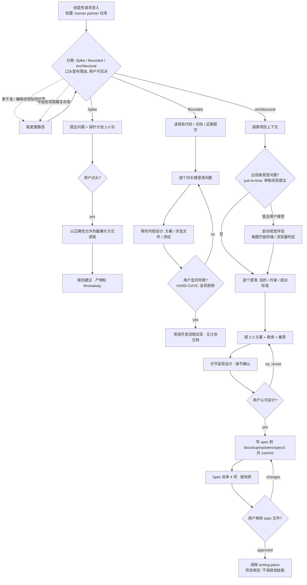

# brainstorming（obra/superpowers）分析卡

> **示范卡说明**：本卡是 skill-teardown 的公开示例，用标准深度完整演示九段产出。
> 被拆对象：[obra/superpowers](https://github.com/obra/superpowers) 仓库中的 `skills/brainstorming/`。
> 素材许可：MIT License（© 2025 Jesse Vincent）。本卡仅摘录原文短句用于结构分析，不代表原作全文；分析结论均为本卡作者判断。
> 快照锚：superpowers main 分支 commit `b36e0829c6d0`（2026-08-12）。

## 1. 元信息

| 字段 | 值 |
|---|---|
| 来源链接 | https://github.com/obra/superpowers/tree/main/skills/brainstorming |
| 分析时间 | 2026-08-29 |
| 版本基准 | 无 Skill 级版本声明（frontmatter 仅 name + description）；版本锚在集合级——server 运行时向上三级读集合 `package.json` / `.codex-plugin/plugin.json` |
| 实际读取的文件清单 | SKILL.md（完整）；visual-companion.md（完整）；spec-document-reviewer-prompt.md（完整）；scripts/start-server.sh（完整）；scripts/stop-server.sh（完整）；scripts/helper.js（完整）；scripts/server.cjs（部分逐行读取：1-120 行完整 + 遥测 / 安全 / 生命周期 / 文件监听段定向检索，其余未逐行）；scripts/frame-template.html（部分逐行读取：结构骨架与 CSS 类名段，样式细节未逐行） |
| Skill 类型 | 对话编排型（主）＋ 方法论型 ＋ 文档链型（architectural 路径产出 spec，链条原文明示） |
| 主领域 / 主场景 | 软件开发前置设计：想法 → 对话收敛 → 设计 / spec |
| 标签 | 设计前置、人类审批门、三路径分流、对话收敛、可视化伴侣 |
| 分析深度 | 标准 |
| 分类置信度 | 高（三标签均有原文直接支撑） |
| 上下游 Skill 关系 | 链式型：上游 = 集合入口路由（using-superpowers，[分析补充]推断，本卡未读该文件）；本 Skill → 下游 = writing-plans（原文明示「the ONLY skill you invoke after brainstorming is writing-plans」）。另弱引用 elements-of-style:writing-clearly-and-concisely（原文明示「if available」，软依赖） |
| evals 覆盖度 | 无 evals（本 skill 目录内未见测试；helper.js 导出纯函数供单元测试的注释暗示集合侧可能存在测试，未核实，[分析补充]） |

**条件字段（命中 1/3）**：

- **所属生态**：命中，**引用式生态（主动）**。共享设施清单：① 硬编码下游 skill 名 writing-plans（终态绑定）；② 软引用 elements-of-style skill（带可用性判断）；③ 集合目录约定 `docs/superpowers/specs/` 与 `skills/brainstorming/` 路径；④ server.cjs 向上三级找集合 manifest 读版本号。单点维护项：集合根的版本号（品牌显示用）。另存在**被编排生态（被动）**形态的可能——被集合路由 skill 发现并调用，[分析补充]推断，本卡未读路由方文件。
- 分发形态：不命中（单一 skill 目录分发，无构建产物 / 多通道）。
- 变体关系：不命中（无多分支变体）。

## 2. 总体分析

把「动手前先对齐设计」做成三路径对话协议：Spike / Bounded / Architectural 按复杂度分流，仪式随任务缩放，人类审批门永不缩放。最值得学的是用 XML 物理隔离的 HARD-GATE 堵「太简单不需要设计」的自我豁免，以及把每个偷懒念头逐条反驳的 Red Flags 表。

## 3. 道：顶层原则

1. **仪式随任务缩放，审批门永不缩放**——流程的轻重可以商量，人类裁量权不可以："the ceremony scales with the task; the approval gate never does"。这解释了为什么三路径的差异全在产物形态（答案 / 聊天内短设计 / spec 文件），而审批动作一条不减。
2. **分类是显式协议动作，不是模型内心活动**——第一问之前必须口头宣布分类及理由："say the classification out loud … so your human partner can override it"。分类错误因此可被人类在第一步拦截，而不是在错误流程跑完后才暴露。
3. **拿不准取更重路径，且棘轮单向**——"When in doubt between two paths, take the heavier one" ＋ "Nothing downgrades mid-task"。隐含成本不对称假设：过度流程浪费的是分钟，跳过审批浪费的是整个实现方向；中途发现隐藏复杂度只升级不降级，防止用「快完了」合理化欠账。
4. **Bounded 测量的是 repo，不是你的熟悉度**——"Bounded measures the repo, not your familiarity. A new project has no existing flow — it is architectural"。直接点名模型最典型的自信错误：用「我懂这类应用」替代「我读过要改的那条流程」。
5. **视觉通道按问题粒度启用，不按会话启用**——just-in-time 提议 ＋ per-question 判定双层控制："would the user understand this better by seeing it than reading?"。有浏览器不等于什么都进浏览器。

## 4. 法：流程框架

**形态判别**：多模式型（3 种模式 ≤6，以最重的 Architectural 为主流程完整展开，Spike / Bounded 以分支标注差异点）。不选状态机型的理由：checklist 有顺序约束，但无 session 冷启动 / 续接与「已完成 gate 不可覆盖」概念——每次任务重新分类，已完成步骤可因用户否决重做。多模式型的特殊约束：路径间存在**单向棘轮**（中途只升级不降级）。

**流程要素对照表**：

| 要素 | 落点 | 模式差异 |
|---|---|---|
| 前置条件 | 收到创造性请求；human partner 在场可响应 | 三路径同 |
| 决策节点 | 分类判别（B，口头宣布可否决）；四个审批门 G1-G4 | Spike 审批 = 一个点头；Bounded = 对短设计的显式 yes；Architectural = 设计认可 + spec 审阅两道 |
| 分支路径 | 三路径主干 + 视觉伴侣按需支线 D2 | Spike 无文档产物；Bounded 无 spec 文件；Architectural 全量 |
| 回退机制 | 被否回退：G2 no→重新澄清、G3 revise→重提方案、G4 changes→重写 spec；**特殊反向约束：路径只升不降**（B2 棘轮，无降级箭头） | 棘轮规则三路径统一 |
| 质量检查点 | HARD-GATE 审批门（全路径终点前）；Spec 自审 4 项（D7）；分类口头宣布（B） | Spike/Bounded 的检查点只有审批门 |
| 结束条件 | **终态绑定路径**（原文 Terminal states are path-bound）：Spike = 建议报告＋throwaway 标注；Bounded = 进入常规开发；Architectural = 调用 writing-plans，且明令禁止调用其他实现类 skill | 三终态互斥 |

## 5. 术：可复用资产

| # | 资产 | 内容（拿走就能用） |
|---|---|---|
| 1 | **Red Flags 表**（Thought vs Reality，7 行） | 原文全表直接可用。逐条把偷懒念头与现实反驳配对，例："This is too simple to need a design" → "Simple means a short design, not no design"。适用于任何「AI 想跳过前置思考」的场景 |
| 2 | **三路径分类决策表** | 判据：Spike = 可行性问题、产出是答案不是留用代码；Bounded = 改的是**本 repo 已存在的流程**（懂这类应用不算）；Architectural = 新项目 / 新子系统 / 改接口。产出列：答案 / 聊天内短设计 / spec 文件。审批列：一律人类显式批准 |
| 3 | **HARD-GATE 话术块** | XML 标签物理隔离（`<HARD-GATE>…</HARD-GATE>`）＋一句不可协商声明。关键句："Do NOT invoke any implementation skill, write any code … until you have told your human partner what you intend and they have approved it" |
| 4 | **棘轮单向规则** | "When in doubt between two paths, take the heavier one" ＋ "hidden complexity discovered mid-task upgrades the path — stop, say so, and step up. Nothing downgrades mid-task." 两句配对即完整机制 |
| 5 | **Spec 自审 4 项清单** | ① Placeholder 扫描（TBD/TODO/空段）②内部一致性（章节互斥？）③范围检查（单个实现计划装得下吗）④歧义检查（能否两种理解）。纪律："Fix any issues inline. No need to re-review — just fix and move on"（防自审变成无限循环） |
| 6 | **子代理 spec 评审派发模板** | spec-document-reviewer-prompt.md：五维检查表（完整性/一致性/清晰度/范围/YAGNI）＋校准段（"Only flag issues that would cause real problems during implementation planning"）＋结构化输出格式（Status/Issues/Recommendations）。⚠️ 该模板未被 SKILL.md 流程引用，属未接线资产（见第 7 段） |
| 7 | **视觉伴侣契约**（可选件） | 启动：`start-server.sh --project-dir <path> --open`，返回 JSON（port / url / screen_dir / state_dir）；内容协议：写 HTML 片段到 screen_dir（禁复用文件名，服务端自动套 frame 模板）；反馈协议：`state_dir/events` JSONL（type/choice/text/timestamp）；CSS 类库：options / cards / mockup / split / pros-cons / mock-* 线框积木 |
| 8 | **平台启动矩阵** | 按 runtime 后台存活策略分支：Claude Code 默认后台；Windows/Git Bash 自动前台（调用方用后台工具包一层）；Codex 检测 `CODEX_CI` 自动前台；Gemini CLI 用 `--foreground` + 工具级后台；Copilot CLI 经 bash 调用保前台 |
| 9 | **视觉 / 终端判定单问** | "would the user understand this better by seeing it than reading?" ＋ 例证："What does personality mean in this context?" 是概念问题走终端，"Which wizard layout works better?" 是视觉问题走浏览器 |

**质量 gate 三类落位**：

| gate | 类别 | 执行者 / 缓解 |
|---|---|---|
| HARD-GATE 审批门（全路径） | 流程确认点 | **人类执行**——客观性最高，无 AI 自评风险 |
| 分类口头宣布＋可否决（B 节点） | 流程确认点 | AI 判别，缓解：① 口头宣布供人类否决 ② 棘轮单向 ③ Red Flags 反「贴轻标签」——三重缓解，仍属 AI 自评 |
| Spec 自审 4 项 | 产物验收点 | AI 自评，存在自我感觉良好风险；缓解：下游 user review gate（人类读 spec 文件）构成人工对照 |
| User Review Gate（G4） | 产物验收点 | 人类执行 |
| Spike 产物 throwaway 标注 | 产物验收点（产物可见性：标注展示） | AI 执行，人类可核查 |
| 信息深度自检 | **未设置**——scope 检查（第 5 项自审）查的是范围聚焦而非回答具体度，不属于本类。如实记录：本 Skill 无显式「够不够具体」型 gate | — |

## 6. 例：好例子 / 坏例子

**好例子**：

- [原文明示] 「presenting the design and starting in the same breath is skipping the gate」——把「边展示边开工」这种最常见的越界显式定义为跳门行为，堵的不是不做设计，而是做完设计不等回应。
- [原文明示] 视觉伴侣判定「A question about a UI topic is not automatically a visual question」，并给出一对例句区分概念问题与视觉问题——防止「有浏览器就什么都放浏览器」的通道滥用。
- [原文明示] stop-server.sh 拒绝杀无法证明身份的 PID："Refuse to signal a PID we can't prove is our server … A stale pid file may point at an unrelated process after a reboot/PID wraparound"，用每次启动注入的 server-instance-id 校验，不明就 fail closed 记 stale_pid。
- [原文明示] 服务端对会话密钥用 timing-safe 比较，密钥同时守护 HTTP 与 WebSocket，注释明说这统一防护 loopback / 隧道 / 远程绑定与 DNS rebinding——安全设计有威胁模型注释，不是装饰。

**坏例子**（Red Flags 表本身就是坏例清单，摘两条＋本卡分析补充两条）：

- [原文明示] "The spike works, so I'll keep the code" → spike 的产出是答案；把探针代码留作交付物是一个新请求，必须重新分类——违反过程产物与交付物的区分。
- [原文明示] "They approved the spike, so the follow-up change is approved too" → 每个任务有自己的分类和自己的审批，审批不可继承。
- [分析补充] spec-document-reviewer-prompt.md 已写好五维检查表与校准段，但 SKILL.md 的 checklist 第 7 步走的是内联自审，全文零处引用该模板——设计好的资产未接线，等于不存在。
- [分析补充] 服务页面品牌区引用远程图 `https://primeradiant.com/brand/…png`（带版本 query）——浏览器侧外联，虽设 `referrerpolicy="no-referrer"`，但离线环境图像损坏无降级说明，隐私敏感场景构成外联痕迹。

## 7. 戒：边界与风险

**适用边界类**：

1. 触发面极宽："You MUST use this before any creative work — creating features, building components, adding functionality, **or modifying behavior**"——任何行为修改都先过对话门，高频小改场景摩擦显著；对无人值守 / 自动化流水线不友好（流程假设 human partner 在场且响应）。[约束推导]
2. Architectural 路径 9 步含 3 个人类门（伴侣提议、设计认可、spec 审阅）＋ 分节确认，用户不响应则流程挂起；它把「人在回路」当价值而非成本，选型时应确认自己的使用形态匹配。[约束推导]
3. Spike / Bounded 分界依赖「要改的流程已在 repo 里可读」这一判读，判读错误会走错路径——有口头宣布＋棘轮兜底，但兜底依赖用户留意分类宣布。[分析补充]

**依赖与安全类**：

- **外部依赖链**：Node.js（server.cjs，**零第三方依赖**，RFC6455 WebSocket 手写实现）；bash（start/stop 脚本，Windows 需 Git Bash，脚本内做 MSYS/MINGW 探测）；集合目录结构（版本号向上三级找 manifest；spec 输出路径 `docs/superpowers/specs/`）；现代浏览器（伴侣）。**缺 Node / 浏览器只影响视觉伴侣，不影响主流程**（原文："a tool — not a mode"）。[原文明示]
- **外部依赖安全模型**：本地 server 不消费外部数据源；唯一外联点是服务页面的远程品牌图（见坏例子）。会话安全做得完整：URL 携带会话密钥＋cookie 镜像＋timing-safe 比较＋umask 077＋owner-PID watchdog＋默认 4 小时空闲自灭。[原文明示]

**一致性类**：

1. **孤儿资产（审查缺口）**：spec-document-reviewer-prompt.md 与主流程断链——checklist 第 7 步「Spec self-review」为内联 4 项自查，SKILL.md 全文 grep 零处引用派发模板；子代理异上下文评审这道缓解因此从未生效。[原文明示]
2. **版本声明三源**：skill frontmatter 无版本；集合 `package.json` 与 `.codex-plugin/plugin.json` 双 manifest；server.cjs 运行时读取用于品牌显示。Skill 级变更（如 SKILL.md 改版）无独立版本锚，快照对账只能靠集合 commit。[原文明示]
3. **触发承诺与路径覆盖不完全对齐**：description 承诺 "any creative work"，Three Paths 的判据全部是代码 / 工程语境（feature / endpoint / subsystem）；纯文案、非代码创作是否走本流程未定义。[约束推导]
4. **两套相对路径基准并存**：SKILL.md 引用伴侣用集合根基准（`skills/brainstorming/visual-companion.md`），visual-companion.md 引用脚本用 skill 内基准（`scripts/…`）——skill 整体移植出集合后前者断链。[原文明示]

## 8. 洞察（分析者判断，与原文严格区分）

**基础四问**：

1. **真正厉害的地方**：它不是教 AI「怎么头脑风暴」，而是给「何时允许停下来问人」立宪。整套设计把最关键的三个 gate（分类否决、设计认可、spec 审阅）全部交给人类，AI 自评只做初筛——在满屏「全自动」叙事的 Agent 工具里，这个反方向选择是刻意且自洽的。
2. **没明说但实际依赖的隐含判断**：① 成本不对称假设（过度流程损耗分钟级、方向错误损耗天级）——棘轮单向是它的制度化表达；② 用户能看懂分类宣布并有效否决——整个第一道防线建立在用户具备这个判别力上；③ 多轮一问一答的对话耐心存在——one question per message 没有提供批量模式兜底。
3. **可迁移场景**：任何「前置对齐」型流程——需求澄清、实验设计、方案评审——都能套三路径分流＋审批门不缩放＋Red Flags 表这套骨架；HARD-GATE 的 XML 物理隔离写法可迁移到任何需要防模型自我豁免的禁令区。
4. **可能过时或不稳的地方**：① 伴侣的 runtime 兼容矩阵（四家 CLI 的后台存活策略各不相同）是最脆的层，runtime 行为一变就要追着修；② 远程品牌图把展示层耦合到了外部服务可用性；③ description 的强触发词（"You MUST"）在不同 runtime 的路由权重下可能过度触发。

**AI 偷懒倾向纠正**（原文显式设计，编号）：

1. 边展示边开工（"presenting the design and starting in the same breath is skipping the gate"）
2. 贴轻标签躲流程（"Reaching for a label to skip work IS the doubt"——把贴标签这个动作本身定义为疑点）
3. 一条消息塞多个问题（"Only one question per message"）
4. 伴侣通道滥用（per-question 判定＋UI 话题≠视觉问题）
5. spike 产物偷渡为交付物（throwaway 标注＋「留代码是新请求」）
6. 用模型自信替代 repo 核实（"Bounded measures the repo, not your familiarity"）
7. 拿别人的审批搭便车（"Each task gets its own classification and its own approval"）

**自评 gate 客观性风险**：本 Skill 最关键的 gate 均为人类执行（HARD-GATE / User Review），客观性风险结构优于同类；AI 自评类 gate（分类判别、spec 自审 4 项）各有口头宣布可否决、棘轮、下游人类审阅三重缓解。**唯一失效的缓解是子代理评审**——模板在库未接线（见第 7 段一致性类），异上下文交叉校核从未发生。

**条件角度（命中 3/8，逐项判别记录）**：

| 角度 | 命中 | 展开与否 |
|---|---|---|
| 完成 / 过程产物区分 | ✅ | spike 全部产物强制 throwaway 标注；spec 是过程产物、交付判定在下游 writing-plans；Red Flags 两条专门防过程产物升格为交付物 |
| 运行时能力探测 | ✅ | 探测对象 = shell 环境 / 平台后台存活策略；方法 = 实际检测（`CODEX_CI` 环境变量、OSTYPE/MSYSTEM 判别、owner PID 可用性探测），非凭记忆；结果决定行为（前台 vs 后台启动、watchdog 开关）；跨平台适配落成启动矩阵。判别依据：探测的是「环境能力」而非「文档存在性」，符合正例 |
| 完成契约 / 终态判定 | ✅ | "Terminal states are path-bound"——三路径终态互斥且 Architectural 终态唯一（writing-plans）；审批门 = 完整呈现＋显式 yes，预授权不可继承 |
| 自指型分析注意事项 | ❌ | 被拆对象是设计前置对话，与分析行为不同类 |
| 终端用户术语隐藏 | ❌ | 面向开发者，无双层术语设计 |
| 词汇控制纪律 | ❌ | 无术语表 / 禁用词约束 |
| agent 间状态共享 | ❌ | 主流程单 agent＋人；子代理模板存在但未接线，不构成实际状态共享 |
| 记忆治理边界 | ❌ | 不涉及 agent 记忆读写 |

## 9. 版本记录

- **分析基准**：2026-08-29；素材快照 = superpowers main `b36e0829c6d0`（2026-08-12），8 文件约 2030 行（server.cjs 与 frame-template.html 部分逐行，见第 1 段清单）；素材本地留档于分析工作区，未改动原仓库任何文件。
- **重析触发条件**：① HARD-GATE / Three Paths / Red Flags 任一结构性变更；② 视觉伴侣架构变更（server 协议、会话密钥机制、平台矩阵增删）；③ spec 评审子代理被接线进主流程（孤儿资产激活将改变第 7 段一致性结论与第 8 段缓解评估）；④ 集合大版本发布或 brainstorming 获得独立版本声明。
- **历史卡对照**：不触发——本卡为该 Skill 首张分析卡，无旧版对照对象。
